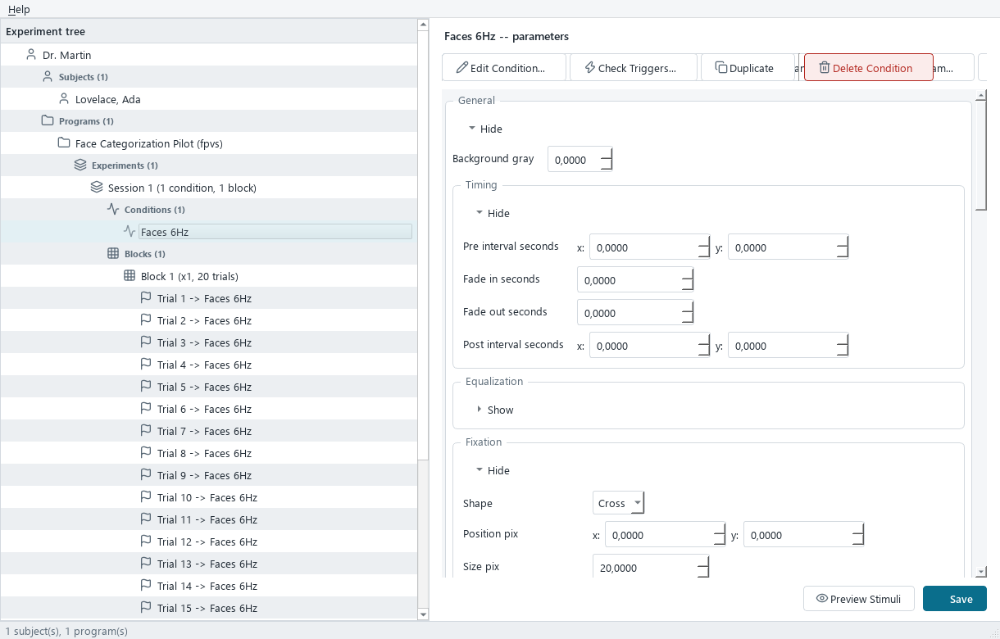
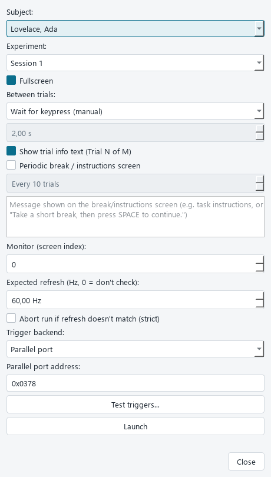
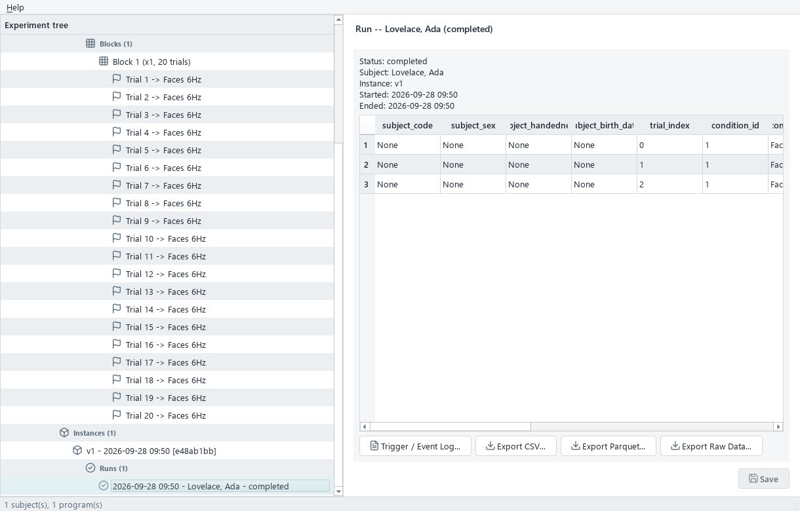

<div align="center">

# xpman

**An open, dongle-free experiment runner for EEG / vision-science studies.**

Build and run **Fast Periodic Visual Stimulation (FPVS)** and **Fast Periodic Auditory Stimulation
(FPAS)** paradigms — no hardware dongle, no proprietary database, free to share with other labs.

[](https://github.com/clmntlts/xpman/actions/workflows/ci.yml)
[](https://github.com/clmntlts/xpman/releases)
[](#-getting-started)
[](#developing-xpman)
[](LICENSE)

📥 **[Download the installer](https://github.com/clmntlts/xpman/releases)** &nbsp;·&nbsp;
📘 **[Guide utilisateur (FR)](docs/GUIDE_UTILISATEUR.md)** &nbsp;·&nbsp;
📖 **[Tutorial (EN)](docs/tutorial.md)** &nbsp;·&nbsp;
🏗️ **[Architecture](docs/architecture.md)**



</div>

---

## What is xpman?

xpman is a **Windows desktop application** for designing EEG frequency-tagging experiments and
running them against participants. It is a from-scratch Python replacement for a legacy closed-source
Java tool ("XP Man / Experiment Manager") that required a paid hardware dongle and stored data in a
discontinued proprietary database (db4o).

- **Everything is a parameter you set in the GUI** — frequencies, stimulus pools, trigger codes,
  fixation marker, response keys. Nothing about "which images are oddballs" or "what frequency to run"
  is hardcoded.
- **Reproducible by design** — you *freeze* an experiment into an immutable **Instance**, then run
  subject after subject against byte-for-byte identical parameters.
- **Open data** — everything lives in a plain **SQLite** file plus **Parquet/CSV** event logs you can
  open with any standard tool. No dongle, no lock-in.

## 📚 Documentation

| Document | What it's for |
|---|---|
| 📘 **[Guide utilisateur](docs/GUIDE_UTILISATEUR.md)** *(FR)* | Non-technical, step-by-step, **with screenshots** — for people who *use* the app. |
| 📖 **[Tutorial](docs/tutorial.md)** *(EN)* | Full walkthrough: every screen, the complete parameter reference, and troubleshooting. |
| 🏗️ **[Architecture](docs/architecture.md)** | Technology choices, package layout, data model, roadmap. |
| 🔬 **[Verification protocol](docs/verification_protocol.md)** | The at-the-lab hardware timing/trigger verification steps. |
| 📊 **[Integration verifier](docs/integration_verifier.md)** | Cross-check triggers against the BioSemi `.bdf` after a run (`xpman-verify`). |
| 🔊 **[Audio calibration](docs/audio_calibration_gate.md)** | The one-time per-machine audio onset-timing calibration (FPAS). |
| 🚀 **[Release process](docs/release_process.md)** | Cutting a release (checklist + machine-specific gotchas). |

## ✨ Paradigms & features

xpman ships three **task types** (chosen once per experiment); everything around a task — the object
hierarchy, the screens, building/launching, and results — is identical across them.

| Task type | Modality | Use it for |
|---|---|---|
| **FPVS** | Visual | Real visual frequency-tagging (faces, objects, words…). **Core timing hardware-verified.** |
| **Auditory FPAS** | Auditory | Real auditory frequency-tagging (voices, sounds…). Needs a one-time per-machine audio calibration. |
| **Dummy** | Visual | Proving the rig (screen timing + triggers) in isolation — **not** a real paradigm. |

**Highlights** (all per-Condition, nothing hardcoded):

- Base/oddball **frequency tagging** on the monitor frame clock (FPVS) or the sound-card sample clock
  (FPAS), with achieved-rate reporting and frame-exactness advisories.
- **Convention-agnostic stimulus pools** by folder + filename pattern — any image/sound set works.
- Sinusoidal **contrast modulation**, oddball **patterns** (`BBBO…`), **frequency sweeps**, per-trial
  **baseline** segments, and a one-off **familiarization** warm-up.
- **Multiple simultaneous streams** (dual bilateral / N-stream designs), each with its own frequency,
  pool, position, and modulation.
- Low-level controls: **position jitter**, **size variation**, and luminance/contrast **equalization**.
- Orthogonal **attention tasks** (fixation distractor or spatial go/no-go), scored by key presses.
- EEG **triggers** over a **parallel port** or a **USB/serial box** (e.g. NEUROSPEC MMBT-S), a
  built-in **Test triggers** tool, and a **photodiode** sync patch for hardware timing checks.
- Results as one tidy row per trial (**CSV/Parquet**), full frame-by-frame **event logs**, and an
  amplifier **integration verifier**.

<div align="center">

&nbsp;&nbsp;

</div>

## ✅ Status & verification

- **FPVS core timing is hardware-verified** on a real BioSemi rig (2026-09-07: photodiode + serial
  MMBT-S — 0 dropped frames, trigger jitter SD ~0.25 ms, base/oddball frame-exact at 5.997 / 1.199 Hz).
- The **advanced FPVS scenarios** (parallel backend, dual streams, sweep, position/size variation) are
  built to spec but **not yet each individually measured** — see
  [`docs/verification_protocol.md`](docs/verification_protocol.md).
- The **auditory FPAS task** is fully configurable and launchable, but its onset timing is **not yet
  hardware-verified**: a per-machine audio-calibration gate shows an advisory warning (never blocks)
  until a loopback measurement passes — see
  [`docs/audio_calibration_gate.md`](docs/audio_calibration_gate.md).

## 🚀 Getting started

### Just want to use xpman?

1. **[Download the latest installer](https://github.com/clmntlts/xpman/releases)**
   (`xpman-setup-<version>.exe`) — or get your lab's shared copy.
2. Double-click it and click through the wizard. It installs **per-user** (no admin rights), adds a
   Start Menu entry, and a normal uninstall entry. **No Python required.**
3. Launch **xpman** from the Start Menu, and follow the **[Guide utilisateur](docs/GUIDE_UTILISATEUR.md)**.

> Using a **parallel port** for triggers? Run `scripts\install_parallel_port_driver.ps1` once (it
> self-elevates) to install the bundled InpOut driver. USB/serial trigger boxes need nothing extra.

### Developing xpman

<details>
<summary><b>One-command dev setup (recommended)</b></summary>

On a machine that already has this checkout, from the repo root:

```powershell
powershell -ExecutionPolicy Bypass -File scripts\setup_dev_env.ps1
```

(`-ExecutionPolicy Bypass` is needed because Windows blocks unsigned scripts by default — it affects
only this one invocation. Inside a permissive PowerShell prompt, plain `scripts\setup_dev_env.ps1`
works too.)

One command, safe to re-run: installs git/Python 3.11 via `winget` if missing, creates `.venv`,
installs the `dev` extra, and runs the test suite as a real smoke test (a clean `pip install` isn't
proof PsychoPy/PySide6 work on this machine's graphics stack). Flags: `-SkipTests`, or
`-IncludeBuildTools` to also install the `build` extra (PyInstaller).

**On a bare machine** (nothing installed, repo not cloned): download just
[`scripts/setup_dev_env.ps1`](scripts/setup_dev_env.ps1) into an empty folder and run the same command
(don't double-click — Windows opens `.ps1` in a text editor). It clones the repo first
(default `.\xpman`; override with `-RepoUrl`/`-Destination`), then proceeds.

</details>

<details>
<summary><b>Manual setup</b></summary>

```powershell
py -3.11 -m venv .venv
.venv\Scripts\Activate.ps1
pip install -e .[dev]
pytest
ruff check src tests
```

Python must be **exactly 3.11** (`pyproject.toml` pins `==3.11.*`) — PsychoPy's dependencies don't
resolve reliably on newer interpreters. Once installed, `xpman` is available as a console command
(alternative to `python -m xpman.gui.app`).

CI (`.github/workflows/ci.yml`) runs `ruff check src tests` + `pytest` on every push/PR on a
`windows-latest` runner. It can't run the hardware-dependent verification protocol — that needs a
physical parallel port, oscilloscope/logic analyzer, and photodiode, and stays a manual lab step.

</details>

<details>
<summary><b>Building a packaged <code>.exe</code> and installer</b></summary>

```powershell
pip install -e .[build]
scripts\build_windows_exe.ps1     # one-folder standalone build at dist\xpman\xpman.exe
scripts\build_installer.ps1       # wraps it into installer\output\xpman-setup-<version>.exe
```

The installer is the thing to hand a lab member: double-click, click through the wizard (license page,
optional desktop shortcut), get a Start Menu entry and an uninstall entry. Installs **per-user** to
`%LOCALAPPDATA%\Programs\xpman`; uninstalling never touches your collected `data\`. Inno Setup is
installed via `winget` automatically if missing (build-machine-only). **Not code-signed** — Windows
SmartScreen shows an "unrecognized publisher" warning on first run.

**Cutting an actual release?** Follow [`docs/release_process.md`](docs/release_process.md) — the full
checklist and the machine-specific gotchas that have shipped broken builds before (e.g. a conda-based
`.venv` freezes into an exe that crashes on launch, with no error at build time).

</details>

## 📊 Verifying against the amplifier (`xpman-verify`)

After a hardware run, cross-check that xpman's triggers actually landed on the BioSemi recording — at
the right time, with the right codes, no dropped frames — using the **integration verifier**. It takes
the run's `.bdf` + `events.csv` and produces one interactive, fully-offline HTML report (trigger
codebook reconciled BDF ↔ xpman, photodiode↔trigger timeline, PC↔BioSemi clock alignment).

- **App (no Python):** build `dist\xpman-verify.exe` with
  `scripts\build_integration_verifier_exe.ps1`, then double-click and pick the two files.
- **From a checkout:** `xpman-verify` (file-picker GUI) or
  `xpman-verify-report --bdf a.bdf --events-csv events.csv --out report.html` (CLI).

Full guide: [`docs/integration_verifier.md`](docs/integration_verifier.md).

## 🧩 Adding a new task type (paradigm)

Task modules are **plugins** registered via `pyproject.toml`'s
`[project.entry-points."xpman.tasks"]`, implementing the `TaskModule` ABC in
[`src/xpman/tasks/base.py`](src/xpman/tasks/base.py). See `src/xpman/tasks/dummy/` for the minimal
reference, `src/xpman/tasks/fpvs/` for a real visual paradigm, and `src/xpman/tasks/auditory_fpvs/`
for the auditory (sample-clock, pre-rendered-buffer) analogue.

## 📄 License

**MIT** — see [`LICENSE`](LICENSE). Free to use, modify, and share with other labs.
