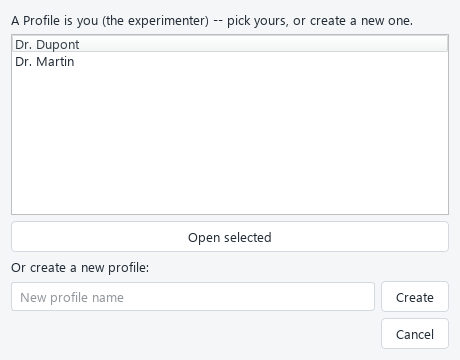
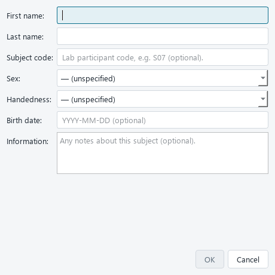
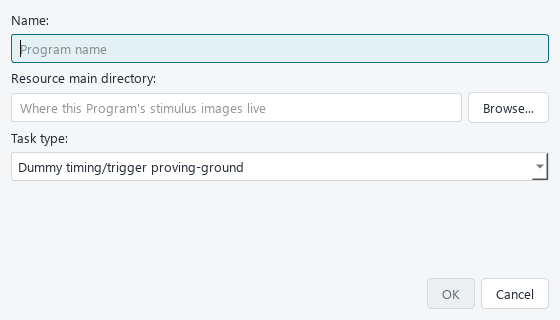
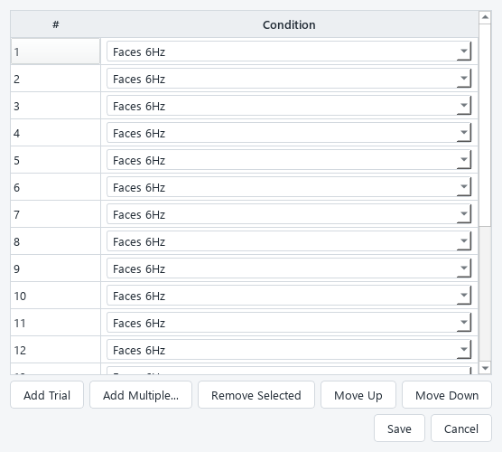
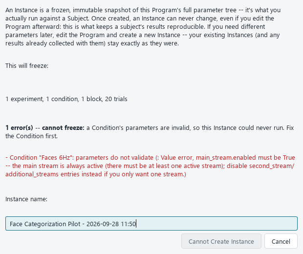
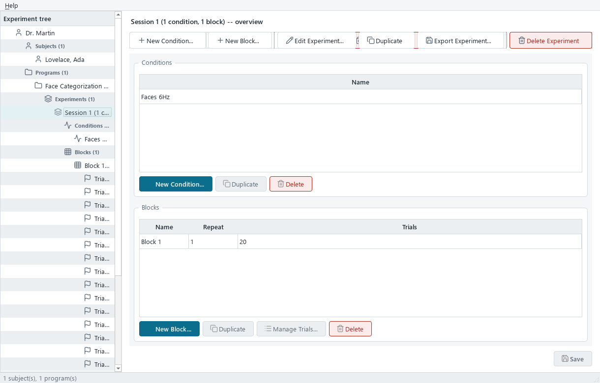

# Guide utilisateur — xpman

> Ce guide s'adresse à la personne qui **utilise** xpman pour préparer et faire passer des
> expériences EEG, pas à un développeur. Il vous permet, à vous seul, de construire une expérience,
> de la faire passer à un participant, puis de récupérer vos données — de bout en bout.
>
> Les libellés en **gras** (`New Program...`, `Save`, `Launch...`, `Fullscreen`, …) sont les textes
> **exacts affichés à l'écran** dans l'application (l'interface est en anglais). Cherchez-les tels
> quels dans xpman.

---

## Table des matières

1. [Introduction](#1-introduction)
2. [Comprendre le fonctionnement général](#2-comprendre-le-fonctionnement-général)
3. [Avant de commencer](#3-avant-de-commencer)
4. [Découvrir l'interface](#4-découvrir-linterface)
5. [Tutoriel principal pas à pas (session FPVS visuelle)](#5-tutoriel-principal-pas-à-pas-session-fpvs-visuelle)
6. [Autres workflows importants](#6-autres-workflows-importants)
7. [Données, formulaires et paramètres](#7-données-formulaires-et-paramètres)
8. [Statuts et états](#8-statuts-et-états)
9. [Consulter et retrouver ses données](#9-consulter-et-retrouver-ses-données)
10. [Exports, téléchargements et résultats](#10-exports-téléchargements-et-résultats)
11. [Profils et paramètres de lancement](#11-profils-et-paramètres-de-lancement)
12. [Autres fonctionnalités utiles](#12-autres-fonctionnalités-utiles)
13. [Résoudre les problèmes fréquents](#13-résoudre-les-problèmes-fréquents)
14. [Bonnes pratiques](#14-bonnes-pratiques)
15. [Guide rapide (aide-mémoire)](#15-guide-rapide-aide-mémoire)
16. [Glossaire](#16-glossaire)
17. [Points à confirmer avec l'équipe](#17-points-à-confirmer-avec-léquipe)

---

## 1. Introduction

**Ce qu'est xpman.** xpman est une **application de bureau Windows** pour **construire et faire
passer des expériences EEG** de type stimulation périodique rapide :

- **FPVS** — *Fast Periodic Visual Stimulation* : un flux rapide d'**images** à une fréquence de base
  (p. ex. 6 Hz) avec un changement de catégorie à une fréquence « oddball » sous-multiple (p. ex.
  1,2 Hz = une image sur 5). La réponse cérébrale à la fréquence oddball indexe la **discrimination
  automatique** entre catégories.
- **FPAS** — *Fast Periodic Auditory Stimulation* : l'équivalent **auditif** (flux de **sons** courts
  avec un oddball périodique).

**À qui il s'adresse.** Aux chercheurs et membres de laboratoire en neurosciences / sciences de la
vision qui font passer ce type de paradigme. Aucune compétence en programmation n'est nécessaire pour
l'utiliser.

**Ce qu'il vous permet de faire.**

- Décrire une expérience entièrement **par des paramètres** que vous réglez dans l'interface (aucune
  fréquence, aucune catégorie, aucun code de trigger n'est « en dur »).
- **Figer** cette description en une version reproductible, la faire passer à autant de participants
  que voulu dans des conditions **strictement identiques**.
- Envoyer des **triggers** (marqueurs) à l'amplificateur EEG au bon moment.
- Récupérer vos données sous forme de **tableaux** (CSV pour Excel, Parquet pour Python/R) et de
  **journaux d'événements** détaillés.

**Ce que vous obtenez à la fin.** Pour chaque passation : un enregistrement de ce qui s'est réellement
produit (essais exécutés, fréquences réellement atteintes, codes de trigger envoyés, réponses
comportementales éventuelles), exportable en un tableau prêt à analyser, plus un journal
image-par-image / son-par-son pour le contrôle qualité et le recalage avec l'EEG.

> xpman remplace un ancien outil fermé qui nécessitait un dongle matériel payant et stockait les
> données dans un format de base de données abandonné. xpman ne nécessite **aucun dongle**, stocke
> tout dans un simple fichier **SQLite** + des journaux **CSV/Parquet** lisibles avec n'importe quel
> outil standard, et peut être installé et partagé librement.

---

## 2. Comprendre le fonctionnement général

### 2.1 Les trois types de tâches

Quand vous créez une expérience, vous choisissez **une fois** un **type de tâche** (`Task type`). Il
détermine ce que fait un essai et quels paramètres s'affichent. **Tout le reste** de l'application
(la hiérarchie, les écrans, la construction, le lancement, les résultats) est **identique** quel que
soit le type.

| Type de tâche | Modalité | À utiliser pour |
|---|---|---|
| **FPVS** | Visuelle | Vraies études de « frequency-tagging » visuel (visages, objets, mots…). Timing **vérifié sur matériel réel**. |
| **Auditory FPAS** | Auditive | Vraies études auditives (voix, sons…). Nécessite une **calibration audio** par machine (voir §6.2). |
| **Dummy** | Visuelle | **Tester le matériel** (timing écran + triggers), **pas** un vrai paradigme. À utiliser en premier sur un poste/ampli suspect. |

### 2.2 La hiérarchie des objets

xpman organise tout dans une hiérarchie fixe. La comprendre rend le reste évident :

```text
Profile                         (vous, l'expérimentateur)
├── Subject(s)                  (les participants)
└── Program(s)                  (le « modèle » d'expérience : on choisit le type de tâche ici)
    ├── Experiment(s)           (un groupe nommé de conditions + blocs)
    │   ├── Condition(s)        (un jeu complet de paramètres, p. ex. « 6 Hz, visages »)
    │   └── Block(s)            (une séquence d'essais, avec un nombre de répétitions)
    │       └── Trial(s)        (un « emplacement » du bloc, pointant vers une Condition)
    └── Instance(s)             (un INSTANTANÉ FIGÉ de tout l'arbre du Program)
        └── Run(s)              (un lancement d'une Instance pour un Subject)
            └── Result(s)       (une ligne par essai réellement exécuté)
```

- **Program** : le conteneur de plus haut niveau. On y choisit le type de tâche et, pour FPVS/FPAS,
  où se trouvent les stimuli (images ou sons).
- **Experiment / Condition / Block / Trial** : sous un Program, vous construisez un ou plusieurs
  **Experiments**. Chacun a ses **Conditions** (jeux de paramètres) et ses **Blocks** (quelle
  séquence jouer et combien de fois). Chaque **Trial** d'un Block est un pointeur vers **une**
  Condition — la liste des Trials d'un Block est donc la séquence réelle que vivra le participant.
- **Instance — la garantie de reproductibilité.** Une Instance est un **instantané figé et en
  lecture seule** de tout l'arbre d'un Program, pris au moment où vous cliquez sur **Create
  Instance**. **Modifier le Program ensuite ne change jamais une Instance déjà créée.** Vous pouvez
  donc faire passer participant après participant sur la même Instance en étant certain qu'ils ont
  vu des paramètres identiques au bit près. Pour changer quelque chose, vous éditez le Program et
  créez une **nouvelle** Instance ; l'ancienne et ses données restent intactes.
- **Run et Result** : un **Run** est une passation (une Instance × un Subject). Un **Result** est une
  ligne de données par essai réellement exécuté pendant ce Run (c'est ce que montrent le tableau de
  résultats et les exports).

### 2.3 Le workflow global

```text
Construire l'expérience  →  Figer une Instance  →  Lancer un Run  →  Consulter / exporter les résultats
(Program → Experiment       (Create Instance)      (Launch...)        (tableau + CSV/Parquet + journal)
 → Condition/Block/Trial)
```

xpman ne lance **jamais** un Program « vivant » directement : il ne lance que des **Instances**. C'est
ce qui garantit que ce qui a tourné est exactement ce qui a été figé.

---

## 3. Avant de commencer

### 3.1 Installer et démarrer xpman

**Pour simplement utiliser xpman** (cas normal) : récupérez l'**installeur Windows**
`xpman-setup-<version>.exe` (copie partagée du labo, ou page **Releases** du projet sur GitHub),
double-cliquez, et suivez l'assistant. Il s'installe **par utilisateur** (aucun droit administrateur
requis), ajoute une entrée au **menu Démarrer**, et une entrée de désinstallation normale dans
« Applications et fonctionnalités ». Lancez ensuite **xpman** depuis le menu Démarrer — aucun Python
requis. Vos données vivent dans un dossier `data\` à côté de l'application et ne sont jamais touchées
par une désinstallation.

> 📷 **Capture à ajouter :** l'entrée « xpman » dans le menu Démarrer de Windows, pour montrer d'où
> lancer l'application après installation.

### 3.2 Ce qu'il faut préparer selon votre besoin

| Vous voulez… | Prérequis à préparer |
|---|---|
| Une session **FPVS** (visuelle) | Un **dossier d'images** organisé en sous-dossiers (p. ex. `faces/`, `objects/`). |
| Une session **FPAS** (auditive) | Un **dossier de sons** organisé en sous-dossiers ; **plusieurs exemplaires** par catégorie ; une **calibration audio** de la machine (voir §6.2). |
| Envoyer des triggers par **port parallèle** | Le pilote **inpoutx64** installé (voir §13.2). |
| Envoyer des triggers par **boîtier USB** (p. ex. NEUROSPEC MMBT-S) | Le boîtier branché ; noter son **port COM** et son **baud** (9600 pour le MMBT-S en mode impulsion). |
| N'importe quelle passation réelle | Au moins un **Subject** créé, et l'écran de stimulation en **plein écran** sur le bon moniteur. |

### 3.3 Checklist de démarrage

- [ ] xpman est installé et se lance depuis le menu Démarrer.
- [ ] (FPVS/FPAS) Mes stimuli sont dans un dossier, rangés en sous-dossiers par catégorie.
- [ ] (FPAS) La machine a passé la **calibration audio** (sinon un avertissement s'affichera au lancement).
- [ ] (Triggers) Le backend de trigger est prêt (pilote parallèle installé, ou port COM/baud du boîtier connus).
- [ ] J'ai créé (ou je vais créer) au moins un **Subject**.

---

## 4. Découvrir l'interface

### 4.1 L'écran de sélection de profil

Au démarrage, xpman affiche **« xpman -- Select Profile »**. Un **Profile**, c'est **vous**,
l'expérimentateur : chaque chercheur peut avoir le sien pour que ses Subjects/Programs restent
séparés.

- Sélectionnez un profil existant et cliquez **Open selected** (ou double-cliquez dessus).
- Ou tapez un nom sous **« Or create a new profile: »** et cliquez **Create** (Entrée fonctionne aussi).
- **Cancel** ferme l'application.



*La fenêtre « Select Profile » : la liste des profils, le champ de création et les boutons **Open
selected** / **Create**.*

### 4.2 La fenêtre principale

- **Panneau de gauche** : l'**arbre** de l'expérience (Profile → Subjects/Programs → …).
- **Panneau de droite** : une **barre d'actions** (rangée de boutons pour le nœud sélectionné, §4.3)
  au-dessus des **détails** de l'élément — soit un **formulaire de paramètres** éditable, soit un
  panneau d'information en lecture seule, soit le tableau de résultats.
- **Bouton `Save`** (en bas à droite) : actif **uniquement** quand vous éditez les paramètres d'un
  Program / Experiment / Condition.
- **Barre d'état** (en bas) : un compteur « N subject(s), M program(s) » et des messages de
  confirmation transitoires (« Saved… », « Exported to… »).
- **Barre de menus** (en haut) : un menu **Help** avec **« Send Feedback / Report a Bug… »** et
  **« About xpman »**.
- La **barre de titre** affiche le nom du profil actif.


*La fenêtre principale : l'**arbre** à gauche, la **barre d'actions** et le **formulaire** de la
Condition sélectionnée à droite, les boutons **Preview Stimuli** / **Save** en bas.*

### 4.3 L'arbre et ses menus clic droit

**Un clic gauche** sur un nœud affiche ses détails à droite. **Un clic droit** ouvre les actions
valides pour ce nœud. **Les mêmes actions apparaissent aussi comme une rangée de boutons visibles**
(la « barre d'actions ») en haut du panneau de droite dès qu'un nœud est sélectionné — vous n'êtes
donc pas obligé de faire un clic droit pour trouver quoi faire ; les deux voies proposent exactement
les mêmes actions.

Actions par nœud :

| Nœud | Actions au clic droit |
|---|---|
| **Profile** (racine) | `New Subject...`, `Import Subject...`, `New Program...`, `Import Program...` |
| **Subject** | `Edit Subject...`, `Export Subject...`, `Delete Subject` |
| **Program** | `New Experiment...`, `Import Experiment...`, `Create Instance...`, `Edit Program...`, `Duplicate`, `Export Program...`, `Delete Program` |
| **Experiment** | `New Condition...`, `New Block...`, `Edit Experiment...`, `Duplicate`, `Export Experiment...`, `Delete Experiment` |
| **Condition** | `Edit Condition...`, `Check Triggers...`, `Preview Stimuli...`, `Duplicate`, `Delete Condition` |
| **Block** | `Manage Trials...`, `Edit Block...`, `Duplicate`, `Move Up`/`Move Down`, `Delete Block` |
| **Trial** | `Move Up`/`Move Down`, `Delete Trial` |
| **Instance** | `Launch...`, `Delete Instance` |
| **Run** | *(aucune action — lecture seule)* |

Les en-têtes de groupe (« Subjects (3) », « Programs (2) »…) proposent aussi les actions
« New… » / « Import… » correspondantes.

**Les libellés de l'arbre sont informatifs** — pas besoin d'ouvrir pour voir l'essentiel :

| Nœud | Format | Exemple |
|---|---|---|
| Subject | `Last, First` | `Smith, John` |
| Program | `nom (type de tâche)` | `FPVS_Study (fpvs)` |
| Experiment | `nom (N condition(s), M block(s))` | `Exp1 (2 conditions, 1 block)` |
| Block | `nom (xR, N trial(s))` | `Block1 (x3, 2 trials)` |
| Trial | `Trial # -> condition` | `Trial 1 -> Face Upright` |
| Instance | `nom - date [empreinte]` | `v1 - 2026-07-01 10:30 [a3f2e8b1]` |
| Run | `date - subject - statut` | `2026-07-01 10:45 - Smith, John - completed` |

---

## 5. Tutoriel principal pas à pas (session FPVS visuelle)

Ce tutoriel construit une session complète, d'un profil vide à un Run terminé avec résultats
exportés. (Pour l'auditif, voir §6.2 ; c'est le même enchaînement.)

### Étape 1 — Ouvrir un profil

**Objectif.** Entrer dans l'application avec votre identité d'expérimentateur.

**Procédure.**
1. Lancez xpman (menu Démarrer).
2. Dans **« Select Profile »**, sélectionnez votre profil et cliquez **Open selected**, ou créez-en
   un (tapez un nom → **Create**).

**Résultat attendu.** La fenêtre principale s'ouvre ; la barre de titre affiche le nom du profil.

**Étape suivante.** Créer un participant.

---

### Étape 2 — Créer un Subject (participant)

**Objectif.** Enregistrer le participant qui fera la passation.

**Procédure.**
1. Clic droit sur la racine **Profile** (ou sur l'en-tête **Subjects**) → **New Subject...**
2. Remplissez au moins **First name** ou **Last name** (au moins un des deux est obligatoire).
3. Facultatif : **Subject code** (identifiant labo, p. ex. `S07`), **Sex**, **Handedness**,
   **Birth date** (`YYYY-MM-DD`), **Information** (notes libres).
4. Cliquez **Ok** (désactivé tant qu'aucun nom n'est saisi).

**Résultat attendu.** Le participant apparaît sous **Subjects** au format `Nom, Prénom`.



> ⚠️ **À vérifier.** Les champs structurés (**Subject code**, **Sex**, **Handedness**, **Birth
> date**) ressortent comme **colonnes dédiées** dans l'export des résultats — pratique pour grouper
> par démographie. Les notes libres, elles, ne sont pas des colonnes.

**Étape suivante.** Créer le Program.

---

### Étape 3 — Créer un Program

**Objectif.** Créer le « modèle » d'expérience et choisir le type de tâche.

**Procédure.**
1. Clic droit sur **Profile** (ou l'en-tête **Programs**) → **New Program...**
2. **Name** (obligatoire), p. ex. `Face Categorization Pilot`.
3. **Resource main directory** : cliquez **Browse** et choisissez le **dossier racine de vos images**
   (celui qui contient vos sous-dossiers de catégories). Facultatif à la création, mais **requis
   avant de lancer** une session FPVS.
4. **Task type** : choisissez **Fast Periodic Visual Stimulation** (c'est le libellé exact de FPVS
   dans le menu).

**Résultat attendu.** Le Program apparaît au format `nom (fpvs)`.



> ⚠️ **À vérifier.** **Le type de tâche ne peut PLUS être changé** après la création du Program.
> Choisissez-le bien. Si le menu **Task type** est vide, votre installation est incomplète (voir
> §13.4).

**Étape suivante.** Créer un Experiment.

---

### Étape 4 — Créer un Experiment

**Objectif.** Regrouper vos conditions et blocs.

**Procédure.** Clic droit sur le Program → **New Experiment...** → saisissez un **Name** (p. ex.
`Session 1`).

**Résultat attendu.** L'Experiment apparaît sous le Program, au format `nom (0 conditions, 0 blocks)`.

**Étape suivante.** Créer une Condition.

---

### Étape 5 — Créer et régler une Condition

**Objectif.** Définir le jeu de paramètres d'un essai (fréquences, stimuli…).

**Procédure.**
1. Clic droit sur l'Experiment → **New Condition...** → saisissez un **Name** (p. ex. `Faces 6Hz`).
   *(Les paramètres ne se règlent pas ici, mais dans le panneau de détail.)*
2. **Clic gauche** sur la Condition pour ouvrir son **formulaire** à droite. Au minimum, réglez :
   - `main_stream.base.base_freq_hz` → `6.0` (fréquence de base).
   - `main_stream.oddball.oddball_freq_hz` → `1.2` (doit être **inférieure** à la base).
   - `main_stream.base_selector.subdirectory` → p. ex. `objects` (le flux de base pioche dans `objects/`).
   - `main_stream.oddball_selector.subdirectory` → p. ex. `faces` (l'oddball pioche dans `faces/`).
   - Laissez le reste par défaut pour commencer (croix de fixation, photodiode).
3. Cliquez **Save**.

**Résultat attendu.** La barre d'état affiche `Saved "Faces 6Hz"`.

> ⚠️ **À vérifier avant de continuer.** Cliquez **Preview Stimuli** (à côté de **Save**) : il liste
> les sous-dossiers disponibles et **combien d'images** chaque sélecteur trouve, en utilisant les
> valeurs actuellement dans le formulaire (même non sauvegardées). Un sélecteur qui trouve **0 image**
> est signalé en rouge — le Run échouerait.

**En cas de problème.**
- **Save reste sans effet / le bouton semble inactif :** vérifiez qu'un message d'erreur rouge
  n'apparaît pas au-dessus du bouton (un champ invalide bloque la sauvegarde silencieusement — voir §13.5).
- **`oddball_freq_hz` refusée :** elle doit être strictement inférieure à `base_freq_hz`.

**Étape suivante.** Créer un Block et y ajouter des Trials.

---

### Étape 6 — Créer un Block

**Objectif.** Définir combien de fois et dans quel ordre les essais seront joués.

**Procédure.** Clic droit sur l'Experiment → **New Block...**
- **Name** (obligatoire).
- **Repeat count** : combien de fois la séquence de Trials est rejouée (défaut 1).
- **Randomize trials** (facultatif) : mélange les Trials **une fois** au moment du figeage
  (Instance) — **le même ordre mélangé pour tous les participants**.
- **Randomize per subject** (facultatif) : re-mélange **par participant** (déterministe : le même
  participant relancé sur la même Instance retrouve son propre ordre).

**Résultat attendu.** Le Block apparaît au format `nom (xR, 0 trials)`.

> **Note.** Les nouveaux Blocks sont toujours ajoutés **à la fin** ; il n'y a pas encore de
> glisser-déposer pour les réordonner (pour corriger l'ordre d'un Block, supprimez-le et recréez-le).

**Étape suivante.** Ajouter des Trials.

---

### Étape 7 — Ajouter des Trials (Manage Trials)

**Objectif.** Construire la séquence réelle d'essais.

**Procédure.**
1. Clic droit sur le Block → **Manage Trials...**
2. **Add Multiple...** → choisissez la Condition `Faces 6Hz` et un nombre (p. ex. `20`) → **Ok**.
   *(Ou **Add Trial** pour en ajouter un à la fois ; **Move Up**/**Move Down** pour réordonner ;
   **Remove Selected** pour retirer.)*
3. Cliquez **Save**. *(Tant que vous ne cliquez pas Save, rien n'est écrit ; **Cancel** annule tout.)*

**Résultat attendu.** Le Block affiche maintenant `nom (xR, 20 trials)`.



> **En cas de problème.** Si **Add** / **Add Multiple...** sont désactivés, c'est que l'Experiment
> n'a encore **aucune Condition** (un Trial doit pointer vers une Condition). Créez d'abord une
> Condition (Étape 5).

**Étape suivante.** Figer une Instance.

---

### Étape 8 — Figer une Instance

**Objectif.** Créer l'instantané reproductible que vous ferez passer aux participants.

**Procédure.**
1. Clic droit sur le **Program** → **Create Instance...**
2. Lisez le résumé (« N experiment(s), M condition(s)… ») et les **contrôles pré-figeage** listés
   automatiquement (Experiments/Blocks vides, Trials sans Condition, paramètres invalides, conflits
   de codes de trigger, dossier de ressources manquant).
3. Ajustez l'**Instance name** (pré-rempli avec le nom du Program + date/heure).
4. Cliquez **Create Instance** (ou **Create Instance Anyway** si des avertissements subsistent — ils
   ne bloquent jamais, mais le bouton change de libellé pour que l'ignorer soit un choix conscient).

**Résultat attendu.** Une **Instance** apparaît sous le Program, au format `nom - date [empreinte]`.



> ⚠️ **À vérifier.** La création est **instantanée et irréversible** (une Instance ne s'édite pas —
> on en crée une nouvelle). Faites-le **une fois par version** de votre design que vous comptez faire
> tourner.

**Étape suivante.** Lancer un Run.

---

### Étape 9 — Lancer un Run

**Objectif.** Faire passer l'expérience à un participant.

**Procédure.**
1. Clic droit sur l'**Instance** → **Launch...**
2. **Subject** : choisissez le participant (s'il n'y en a aucun, le dialogue le dit et désactive
   **Launch** — créez-en un d'abord).
3. **Experiment** : choisissez l'Experiment à jouer (**un seul par Run**).
4. **Between trials** : laissez **Wait for keypress (manual)** pour une vraie session EEG (l'essai
   attend un appui sur **ESPACE** avant de démarrer), ou choisissez l'auto-avance avec un délai.
5. Facultatif — **Periodic break / instructions screen** : cochez, réglez **Every N trials** et
   écrivez un message. Il s'affiche et attend ESPACE à l'essai 1 (sert d'écran d'instructions) puis
   tous les N essais, quel que soit le réglage « Between trials ».
6. **Monitor (screen index)** : si l'écran de stimulation n'est pas l'écran principal.
7. Laissez **Fullscreen** coché (la précision du timing en dépend).
8. **Trigger backend** : **None (dry run)** (test sans ampli), **Parallel port**, ou **Serial (USB)**
   (voir §11.2 pour les champs qui apparaissent selon le choix).
9. **Test triggers…** (recommandé avant d'engager un sujet) : envoie une impulsion de test (ou un
   balayage 1–255) via le backend choisi, pour **confirmer sur le canal trigger de l'ampli** que les
   codes arrivent.
10. Cliquez **Launch**. L'expérience tourne dans un **processus séparé** (pour un timing intact) ;
    une barre de progression suit les essais.
11. **Abort** : à tout moment ; xpman **termine l'essai en cours proprement** puis s'arrête.


*Le dialogue **Launch...** : Subject, Experiment, Between trials, écran de pause, Monitor,
**Fullscreen**, **Trigger backend** (avec ses champs), **Test triggers…**, **Launch**.*

**Résultat attendu.** À la fin, un message indique : **`Run completed.`**, **`Run aborted.`**, ou (en
cas de souci) **`Run crashed: …`** / **`Could not start the run: …`** avec l'erreur. Le dialogue reste
ouvert (relancez un autre Subject, ou fermez).

> ⚠️ **À vérifier.** Si vous fermez la fenêtre **pendant** un Run, xpman demande « Stop the run and
> close? » — **Yes** stoppe et ferme la fenêtre plein écran ; **No** laisse tourner.

**En cas de problème.** Voir §13.3 (Run « crashed »/« could not start »), §13.2 (triggers).

**Étape suivante.** Consulter les résultats.

---

### Étape 10 — Consulter et exporter les résultats

**Objectif.** Vérifier la passation et récupérer les données.

**Procédure.**
1. Dépliez le groupe **Runs** sous l'Instance, puis **clic gauche** sur le nouveau **Run**.
2. Vérifiez le **statut**, le **Subject**, et le **tableau** (une ligne par essai exécuté).
3. Cliquez **Export CSV...** (pour Excel) ou **Export Parquet...** (pour Python/R) et choisissez où
   enregistrer.

**Résultat attendu.** Un fichier tableur où **chaque ligne** porte tout son contexte
(Run/Subject/Instance/Condition) — directement analysable.

**Étape suivante.** Pour tester d'autres paramètres : éditez la Condition (ou ajoutez-en) sur le
**même Program**, puis refaites l'Étape 8 pour figer une **nouvelle** Instance. Votre première
Instance et ses résultats restent intacts.

---

## 6. Autres workflows importants

### 6.1 Tester le matériel avec la tâche Dummy

Avant de faire confiance à un poste/ampli, créez un Program de type **Dummy**. Il fait clignoter un
carré noir↔blanc à `flip_rate_hz` pendant `duration_seconds` et envoie **un code de trigger par
flip**. Pointez un photodiode/oscilloscope sur le carré et la ligne de trigger : les flips doivent
tomber à une frame d'intervalle sans dérive, et les impulsions de trigger correspondre aux
horodatages du journal. Une session Dummy propre = la « plomberie » (timing, triggers, journalisation)
est saine.

### 6.2 Faire passer une session auditive (FPAS)

Créez un Program de type **Auditory FPAS**. Le déroulé est identique (Program → Experiment →
Condition/Block/Trial → Instance → Run → Résultats) ; ce qui diffère :

- **Des sons au lieu d'images.** Pointez le **Resource main directory** vers vos sons et réglez les
  `subdirectory`/`filename_pattern` de chaque flux (p. ex. `voices` vs `objects`). Utilisez
  **beaucoup d'exemplaires** par catégorie (sinon la réponse reflète une forme d'onde répétée, pas un
  changement de catégorie). La tâche **avertit** si les sélecteurs base/oddball désignent les mêmes
  fichiers.
- **Timing sur l'horloge de la carte son** (pas le moniteur). Les fréquences de base sont plus basses
  que le 6 Hz visuel (**2–4 Hz** typiquement).
- **Un écran de fixation pendant l'écoute** : fond (`background_gray`) + croix de fixation centrale
  (mettez la forme de fixation à `none` pour la masquer).
- **Contrôles spécifiques** : égalisation **RMS** (contrôle de sonie), fondus d'entrée/sortie de
  séquence, pas de répétition immédiate d'exemplaire, et une **tâche de détection de baisse de
  volume** (appuyer quand un son est plus faible) comme contrôle attentionnel.
- **Une étape supplémentaire avant d'enregistrer — la calibration audio.** Le timing d'attaque audio
  dépend du matériel de la machine et **n'est pas fiable tant qu'il n'est pas mesuré**. La tâche se
  lance et joue du son (utilisable pour la préparation/le pilotage), mais **tant que la machine n'a
  pas passé une calibration audio en boucle**, le lancement affiche un **avertissement fort (mais non
  bloquant)** que vous devez confirmer. Voir `docs/audio_calibration_gate.md` et
  `docs/audio_calibration_rig_procedure.md`.

### 6.3 Réutiliser un design : Duplicate

**Duplicate** (clic droit) copie l'élément **avec tous ses paramètres** sous `"<nom> (copy)"` et
sélectionne la copie. Dupliquer un Experiment ou un Program est une copie **profonde** (toutes les
Conditions/Blocks/Trials suivent, les Trials pointant vers les Conditions copiées). C'est la façon
rapide de créer une variante qui ne diffère que d'un paramètre : **Duplicate → renommer → ajuster**.
Les Instances et Runs ne sont jamais copiés.

### 6.4 Transférer entre machines : Export / Import

**Duplicate** copie **dans** la base courante ; **Export / Import** déplace un Subject, un Program ou
un Experiment **entre machines** :

- **Export...** (clic droit) écrit un fichier **`.json` autonome**.
- Sur une autre installation, **Import...** sur la cible correspondante (un Profile pour un
  Subject/Program ; un Program pour un Experiment) le recrée.
- L'import **ajoute toujours** un nouvel élément (jamais d'écrasement) et le renomme `"<nom> (copy)"`
  si le nom existe déjà — l'import est donc toujours sans risque.
- Seul l'**arbre de design éditable** voyage ; les Instances, Runs et Results restent en place (pour
  les données, utilisez les exports de résultats, §10). Un Program/Experiment emporte tout son arbre
  Condition/Block/Trial, liens Trial→Condition préservés.

---

## 7. Données, formulaires et paramètres

### 7.1 Le formulaire de paramètres (schema form)

Sélectionner un **Program** ou une **Condition** affiche un formulaire généré à partir des paramètres
de la tâche :

- Chaque champ a un **libellé** et une **infobulle** (survolez) expliquant son rôle et ses contraintes.
- Champs texte, compteurs numériques (min/max intégrés), cases à cocher et menus déroulants
  s'affichent selon le type du champ.
- Les champs **facultatifs** ont une petite case **`Set`** : décochée = « non défini / aucune
  valeur », cochée = activer et éditer.
- Les réglages liés sont regroupés en **boîtes libellées** (p. ex. tous les réglages de fixation
  ensemble).
- Éditez, puis **Save**. Si une valeur est invalide, Save refuse : le(s) champ(s) fautif(s)
  s'entourent de rouge avec un message, et un résumé apparaît au-dessus du bouton.

> Modifier les paramètres d'un Program/Experiment/Condition n'affecte que les **futures** Instances.

### 7.2 Le Subject

| Champ | Obligatoire ? | Format | Remarque |
|---|---|---|---|
| **First name** / **Last name** | Au moins un des deux | texte | Sinon **Ok** reste désactivé. |
| **Subject code** | Facultatif | texte | Identifiant labo (≠ id interne). Colonne dédiée à l'export. |
| **Sex** / **Handedness** | Facultatif | liste | Laisser sur « — (unspecified) » pour ne rien enregistrer. |
| **Birth date** | Facultatif | `YYYY-MM-DD` | Une date mal formée est **refusée**. |
| **Information** | Facultatif | texte libre | Notes de session ; en lecture seule ensuite. |

### 7.3 Le Program

| Champ | Obligatoire ? | Remarque |
|---|---|---|
| **Name** | Oui | — |
| **Resource main directory** | À la création : non ; pour lancer FPVS/FPAS : **oui** | Dossier racine des stimuli (sous-dossiers par catégorie). |
| **Task type** | Oui | Le menu propose : **Fast Periodic Visual Stimulation** (FPVS), **Auditory FPAS (periodic oddball)**, **Dummy timing/trigger proving-ground**. **Non modifiable** après création. |

### 7.4 Organisation des dossiers de stimuli

Convention **agnostique** : les stimuli sont choisis par **sous-dossier** et/ou **motif de nom de
fichier**, pas par une convention « faces vs objects » imposée. Rangez vos fichiers comme vous voulez
(p. ex. un sous-dossier par catégorie) et pointez chaque **sélecteur** vers le bon dossier :

```text
<Resource main directory>/
├── faces/     (→ oddball_selector.subdirectory = faces)
└── objects/   (→ base_selector.subdirectory = objects)
```

- `subdirectory` (facultatif) : sous-dossier relatif au dossier de ressources ; vide = tout le jeu ;
  inclut les sous-dossiers imbriqués.
- `filename_pattern` (facultatif) : motif type `*happy*.png` combiné (ET) avec le sous-dossier.

### 7.5 Référence des paramètres — Condition FPVS

> Program et Experiment n'ont pas de paramètres. Ci-dessous les paramètres d'une **Condition FPVS**,
> regroupés par section (boîtes du formulaire). Réglages « par flux » : chaque flux (**Stream 1
> (main)**, **Stream 2**, …) a sa propre copie de `base`, `oddball`, sélecteurs et `modulation`.

**Séquence de base (`base`)**

| Champ | Type | Défaut | Contrainte | Sens |
|---|---|---|---|---|
| `base_freq_hz` | nombre | 6.0 | > 0 | Fréquence de stimulation du flux de base. |
| `trial_duration_seconds` | nombre | 10.0 | > 0 | Durée du flux de base pour cet essai. |
| `base_trigger_code` | entier, opt. | non défini | 1–255 | Trigger à chaque image de base ; non défini = aucun. |

**Oddball (`oddball`)**

| Champ | Type | Défaut | Contrainte | Sens |
|---|---|---|---|---|
| `oddball_freq_hz` | nombre | 1.2 | > 0, **strictement < `base_freq_hz`** | Fréquence oddball. Ignorée si `pattern` est défini. |
| `oddball_trigger_code` | entier, opt. | non défini | 1–255 | Trigger à chaque oddball ; non défini = aucun. |
| `pattern` | texte, opt. | non défini | tokens `B`/`O`, ≥1 chacun, longueur ≥ 2 | Ordre base/oddball explicite (p. ex. `BBBBO`). **Remplace** `oddball_freq_hz` : fréquence = `base × (#O/len)`. |

**Modulation de contraste (`modulation`)** — forme du contraste sur le cycle (défaut : fondu
sinusoïdal FPVS canonique).

| Champ | Type | Défaut | Sens |
|---|---|---|---|
| `waveform` | liste | `sinusoidal` | `sinusoidal` (FPVS standard) / `square` (on-off) / `none` (pleine opacité). |
| `contrast_min` / `contrast_max` | nombre 0–1 | 0.0 / 1.0 | Opacité aux points les plus sombre / clair du cycle. |
| `square_onset_fraction` | nombre, > 0 et ≤ 1 | 0.5 | *`square` uniquement :* fraction du cycle « on ». |

**Chronologie de l'essai (`timing`)** — un essai déroule : pré-intervalle (fixation) → fondu d'entrée
→ plateau → fondu de sortie → post-intervalle. Plateau = `base.trial_duration_seconds`. Tout à 0 par
défaut.

| Champ | Type | Défaut | Sens |
|---|---|---|---|
| `pre_interval_seconds` | (min, max) | (0, 0) | Fixation seule avant stimulation (durée tirée dans [min, max]). |
| `fade_in_seconds` / `fade_out_seconds` | nombre | 0.0 | Rampe de contraste 0→1 / 1→0. |
| `post_interval_seconds` | (min, max) | (0, 0) | Fixation seule après stimulation. |

**`background_gray`** (0–1, défaut 0.5) — niveau de gris vers lequel la stimulation se fond. Doit
correspondre à la **luminance moyenne des images** (gris moyen) pour que la modulation d'opacité soit
une vraie modulation de **contraste**.

**Sélecteurs de stimuli (`base_selector`, `oddball_selector`)** — voir §7.4.

**Marqueur de fixation (`fixation`)** — `shape` (`none`/`cross`/`bars`), `position_pix`, `size_pix`,
`line_width_pix`, `color`, et pour `bars` : `bar_gap_pix`, `bar_orientation` ; option
`show_background_rect` + `background_rect_size_pix` + `background_color`.

**Patch photodiode (`photodiode`)** — petit carré clignotant dans un coin pour vérifier le timing
matériel : `enabled` (on par défaut), `toggle_strategy` (`every_stimulus_onset` /`every_n_frames`
/`oddball_onset_only`), `corner`, `margin_pix`, `size_pix`, `color_on`/`color_off`, `position_pix`
(override).

**Contrôles anti-adaptation bas niveau :**
- **`position_jitter`** — position aléatoire de chaque image dans une région (`rectangle`/`disk`),
  `per` = `stimulus`/`trial`. Seule l'image bouge (fixation et photodiode restent fixes).
- **`size_variation`** — redimensionnement aléatoire de chaque image (`min_scale`/`max_scale`,
  FPVS canonique ~0.74–1.2), `per` = `stimulus`/`trial`.

**Égalisation luminance/contraste (`equalization`)** — normalise chaque pool vers la moyenne du pool
**combiné**, pour qu'un écart de luminance/contraste **entre** base et oddball ne se fasse pas passer
pour une réponse de catégorisation à la fréquence oddball : `enabled` (off), `equalize_luminance`,
`equalize_contrast`, `strength` (0–1).

**Tâches attentionnelles (une seule à la fois) :**
- **`distractor`** — changement bref **au point de fixation** ; le sujet appuie quand il le détecte.
  Scoré en détection de signal (hits/misses/fausses alarmes/hit-rate/RT).
- **`go_nogo`** — plusieurs marqueurs à positions fixes ; règle de **conjonction** (tous signalent =
  GO/répondre ; un seul = NO-GO/inhiber). Scoré en détection de signal + d′.

> **Une seule tâche attentionnelle par Condition.** Activer une seconde est **refusé** au
> save/figeage (elles partagent le clavier et le canal trigger).

**Séquences avancées :**
- **`sweep`** (balayage de fréquence) — plusieurs **étapes** de fréquence enchaînées (`steps`, ≥ 2
  quand activé), remplaçant la base/oddball unique. Analyse **par étape**.
- **`baseline`** (ligne de base par essai) — segment **base seule (sans oddball)** avant/après/les
  deux, comme plancher de bruit. ⚠️ une baseline `before` (système non adapté) ≠ `after` (post-
  adaptation) : gardez `position` constant dans une étude.
- **Flux multiples (`second_stream`, `additional_streams`)** — plusieurs flux d'images simultanés
  (p. ex. gauche/droite d'une fixation partagée), chacun avec sa fréquence, ses pools, sa position,
  sa modulation, et une case `oddball_enabled` (décochée = flux « remplissage » base seule). Chaque
  flux actif doit avoir une **position distincte**. L'analyse fréquentielle sépare les réponses ;
  jusqu'à **deux** flux peuvent utiliser des triggers par flux (avec des `coincidence_codes`).

**Familiarisation (`familiarization`)** — flux d'échauffement base seule montré **une fois** au début
du Run (avant le 1er essai) : `enabled`, `duration_seconds`, `frequency_hz`, `modulation`,
triggers start/stop, `post_blank_seconds`.

### 7.6 Référence des paramètres — Condition FPAS (auditive)

Mêmes principes ; principales spécificités (voir §6.2) : sélecteurs de **sons** au lieu d'images,
fréquences de base 2–4 Hz, **RMS equalization**, fondus de séquence, tâche de **détection de baisse
de volume**, écran de fixation. Réglez au minimum la fréquence de base, la fréquence oddball, et les
sous-dossiers base/oddball, comme en FPVS.

### 7.7 Format des fichiers Export / Import de design

- **Design (Subject/Program/Experiment)** : fichier **`.json` autonome** produit par **Export...** et
  relu par **Import...** (voir §6.4). N'y mettez rien à la main ; il est généré par xpman.
- **Résultats** : voir §10 (CSV/Parquet).

---

## 8. Statuts et états

### 8.1 Statut d'un Run

Le statut apparaît dans le libellé du Run (`… - status`) et en tête du tableau de résultats.

| Statut | Signification | Que devez-vous faire ? |
|---|---|---|
| **completed** | Le Run est allé au bout normalement. | Rien — consultez/exportez les résultats (§10). |
| **aborted** | Vous avez cliqué **Abort** (ou fermé en confirmant l'arrêt). L'essai en cours a fini proprement ; tous les Results déjà enregistrés sont conservés. | Vérifiez combien d'essais ont été faits ; relancez si besoin. |
| **crashed** | Une erreur a interrompu le Run. | Lisez le message d'erreur du dialogue de lancement + §13.3 ; corrigez, refigez une Instance si nécessaire. |

> Le dialogue de lancement peut aussi afficher **`Could not start the run: …`** (erreur de démarrage,
> avant tout essai) : ce n'est pas un statut enregistré, mais une erreur de configuration à corriger
> (voir §13.3).

### 8.2 État figé d'une Instance

Une Instance est **immuable** dès sa création. On ne l'édite pas : pour changer le design, on édite le
Program et on crée une **nouvelle** Instance. **Supprimer une Instance n'est autorisé que si elle n'a
aucun Run** (supprimer une Instance avec des résultats les détruirait — un résultat ne s'interprète
qu'à travers l'instantané figé de son Instance).

### 8.3 Le « gate » entre essais

En mode **Wait for keypress (manual)**, chaque essai attend un appui sur **ESPACE** avant de démarrer.
L'écran de pause **Periodic break / instructions screen** (s'il est activé) attend **toujours** une
touche, quel que soit le mode. Les réponses clavier des tâches attentionnelles doivent être appuyées
**pendant** la stimulation, pas pendant ces écrans d'attente (voir §13.7).

---

## 9. Consulter et retrouver ses données

- **Naviguer** : dépliez l'arbre. Sous une Instance, le groupe **Runs** liste les passations
  (`date - subject - statut`).
- **Le panneau de détail** selon le nœud : Subject/Block/Trial/Instance = lecture seule ;
  Program/Condition = formulaire ; Experiment = **build hub** (tableaux Conditions & Blocks avec
  boutons New/Duplicate/Delete et **Manage Trials...**) ; Run = **visionneuse de résultats**.



*Le **build hub** d'un Experiment : les tableaux **Conditions** et **Blocks** (avec Repeat et nombre
de Trials) et leurs boutons New / Duplicate / Manage Trials... / Delete — c'est là que se fait
l'essentiel de la construction sans passer par l'arbre.*
- **Visionneuse de résultats d'un Run** : statut, Subject, Instance, heures début/fin, et un tableau
  **une ligne par essai exécuté** (colonnes propres à la tâche : flips, codes de trigger, précision
  des réponses…). Si le Run n'a aucun résultat (crash immédiat), un message clair remplace un tableau
  vide.
- **Journal d'événements** (`Trigger / Event Log...` depuis un Run) : onglets **Summary** et
  **Timeline** — chaque événement horodaté (flips, `trigger_sent`, onsets stimulus/oddball, marqueurs
  de segment/overlay, événements des tâches attentionnelles).
- **Où sont mes données ?** Dans le dossier `data\` **à côté de l'application** : `data\xpman.db`
  (base SQLite : Profiles/Subjects/Programs/…/Results) et `data\runs\` (un journal Parquet + CSV par
  Run). Ce dossier est ancré au dossier de l'app, pas au dossier courant du shell.


*Un Run sélectionné : l'en-tête (statut, Subject, Instance, heures), le tableau **une ligne par
essai**, et les boutons **Trigger / Event Log...**, **Export CSV...**, **Export Parquet...**,
**Export Raw Data...**.*

---

## 10. Exports, téléchargements et résultats

Tout se fait depuis le panneau de détail d'un **Run** (ou d'une **Instance** pour l'export global).

| Action | Où | Ce que ça produit |
|---|---|---|
| **Export CSV...** | panneau d'un **Run** | Un tableau, **une ligne par essai**, chaque ligne portant le contexte Run/Subject/Instance/Condition. S'ouvre dans Excel. |
| **Export Parquet...** | panneau d'un **Run** | Les mêmes données pour pandas/R/etc. |
| **Trigger / Event Log...** | panneau d'un **Run** | La visionneuse d'événements (onglets **Summary** / **Timeline**). |
| **Export Raw Data...** | panneau d'un **Run** | Un **paquet brut complet** : tous les événements horodatés + un manifeste de provenance (Run/Subject/Instance) + les paramètres figés de la Condition. C'est ce que consomme le vérificateur d'intégration. |
| **Export All Results (CSV)…** / **…(Parquet)…** | panneau d'une **Instance** | Combine **tous les Runs** de cette Instance en un seul tableau. |

Un dialogue d'échec s'affiche plutôt qu'un plantage ; un dialogue de sauvegarde annulé ne fait rien.

**Recalage avec l'EEG (contrôle qualité).** Après une passation, vérifiez que les triggers de xpman
ont bien atterri sur l'enregistrement BioSemi (bons codes, bon timing, aucune frame perdue) avec le
**vérificateur d'intégration** (`xpman-verify`) : il transforme le `.bdf` + `events.csv` du Run en un
rapport interactif unique (voir `docs/integration_verifier.md`).

---

## 11. Profils et paramètres de lancement

### 11.1 Profils

Plusieurs Profiles peuvent coexister dans la même base (§4.1). Ils séparent les Subjects/Programs de
chaque chercheur. **Pas de sessions GUI simultanées** sur la même base (un chercheur, une machine,
une base — voir §16 « base partagée » dans la FAQ ci-dessous).

### 11.2 Choix et réglage du backend de trigger (dialogue Launch)

| Backend | Champs qui apparaissent | Quand l'utiliser |
|---|---|---|
| **None (dry run)** | *(aucun)* | Test sur un portable sans amplificateur. |
| **Parallel port** | **Parallel port address** (défaut `0x0378`, accepte hex `0x0278` ou décimal) | Ampli câblé sur un vrai port parallèle (LPT). Si les triggers n'arrivent pas, vérifiez l'adresse réelle (Gestionnaire de périphériques) et le pilote (§13.2). |
| **Serial (USB)** | **Serial (COM) port** (p. ex. `COM4`), **Baud rate** (défaut **9600**, taux du MMBT-S en mode impulsion), **Init settle (s)** (attente après ouverture, défaut 0) | Boîtier USB/série type **NEUROSPEC MMBT-S**. Aucun pilote kernel à installer. |

**Test triggers…** ouvre un petit dialogue : envoyez une **impulsion unique** ou un **balayage
complet 1–255** via le backend choisi, avec un intervalle réglable, pour confirmer **sur l'ampli** que
les codes arrivent — *avant* d'engager un participant. Un trigger est **write-only** : xpman peut
envoyer mais pas relire ; la confirmation se fait côté EEG.

### 11.3 Autres réglages de lancement

- **Fullscreen** (coché par défaut) : indispensable en session réelle (précision du timing).
- **Monitor (screen index)** : l'écran de stimulation, 0 = principal.
- **Between trials** : manuel (ESPACE) ou auto-avance ; **Periodic break / instructions screen**
  (voir §5 Étape 9 et §8.3).

---

## 12. Autres fonctionnalités utiles

- **Check Triggers…** (clic droit sur une Condition) — passe en revue des avertissements de
  configuration : aucun code de trigger défini, fréquence non « frame-exacte » sur le moniteur,
  collisions de fréquences entre flux, oddball trop rapproché, fondus à 0 s, jitter/size sans effet,
  etc. Purement consultatif (ne bloque jamais).
- **Preview Stimuli…** (clic droit sur une Condition, ou bouton à côté de **Save**) — combien
  d'images/sons chaque sélecteur trouve (0 = signalé), avec les sous-dossiers disponibles ; utilise
  les valeurs du formulaire, même non sauvegardées.
- **Aperçu schématique d'une Condition** — représentation de la disposition à l'écran et de la
  chronologie.
- **Envoyer un retour / signaler un bug** — menu **Help → Send Feedback / Report a Bug…** : compose
  un rapport (type + votre note + version/OS automatiques) et ouvre une issue GitHub pré-remplie, un
  e-mail, ou copie dans le presse-papiers. **Rien n'est envoyé automatiquement.**

---

## 13. Résoudre les problèmes fréquents

### 13.1 L'application ne démarre pas (installation depuis les sources)

**Symptôme.** `python -m xpman.gui.app` échoue immédiatement.
**Solution.** Vérifiez que l'environnement virtuel est activé et que vous lancez depuis la racine du
dépôt (Python 3.11, `pip install -e .[dev]`). *(Une installation par l'installeur n'est pas
concernée.)* Une erreur `no such column: runs…` ne devrait plus se produire (migration automatique au
démarrage) ; si un message dit que la base « a des tables xpman mais aucun tampon de version », c'est
une base ancienne : renommez `data\xpman.db` puis relancez pour repartir propre.

### 13.2 Les triggers n'arrivent pas / erreurs de port parallèle

**Symptôme.** Aucun trigger sur l'ampli ; erreur au test/lancement en **Parallel port**.
**Cause possible.** Le pilote **inpoutx64** n'est pas installé (sous Windows 11 il doit être placé
dans `System32`/`SysWOW64`, pas seulement le dossier de l'app), ou la mauvaise **adresse** de port.
**Solution.**
1. Lancez `scripts\install_parallel_port_driver.ps1` **en tant qu'administrateur** (il s'auto-élève
   et guide ; s'il ne trouve pas le DLL `inpoutx64.dll`, il indique où le déposer).
2. Vérifiez l'adresse réelle du port dans le **Gestionnaire de périphériques** (une carte PCIe LPT
   n'est souvent **pas** à `0x0378`).
3. Utilisez **Test triggers…** pour confirmer.
*(Pas d'ampli ? Mettez **None (dry run)**.)*

### 13.3 Un Run est « crashed » ou « could not start »

Le message du dialogue contient l'erreur. Causes fréquentes :
- **Program FPVS sans `resource_main_directory`**, ou dossier sans images utilisables → corrigez le
  Program, puis créez une **nouvelle** Instance (l'ancienne reste figée avec le mauvais chemin).
- **Port parallèle absent/inaccessible** → §13.2, ou passez en **None**.
- **« Could not measure the monitor's refresh rate »** → xpman refuse de deviner 60 Hz (le timing
  FPVS serait faux). Assurez-vous que la fenêtre est **plein écran** sur le bon moniteur, vsync
  activée, affichage non dupliqué, puis relancez.

### 13.4 « No task types are registered »

Le menu **Task type** est vide. Signifie que la découverte des tâches n'a trouvé aucun module
(anormal sur une installation standard). En développement : relancez `pip install -e .[dev]`. En
installeur : réinstallez.

### 13.5 Le bouton Save ne fait rien / est grisé

Il n'est actif que sur le formulaire d'un **Program/Experiment/Condition**. S'il ne sauvegarde pas,
cherchez un **message d'erreur rouge** au-dessus du bouton : Save refuse silencieusement des données
invalides. Corrigez les champs signalés.

### 13.6 Je ne peux pas créer de Trial

Un Trial doit pointer vers une Condition. Si l'Experiment n'en a **aucune**, **Add**/**Add
Multiple...** sont désactivés — créez d'abord une Condition (§5 Étape 5).

### 13.7 Les réponses clavier (distractor / go-no-go) ne sont pas enregistrées

Ouvrez **Trigger / Event Log… → Summary** et lisez la ligne **Keyboard capture** :
- **`total_presses=0`** = le clavier n'est pas lu du tout → assurez-vous que la fenêtre plein écran a
  le **focus** (cliquez dedans, ne faites pas alt-tab) et appuyez **pendant** la stimulation (pas
  pendant l'écran « Press SPACE to start »).
- Des appuis capturés mais 0 événement scoré = les touches pressées ne correspondent pas aux `keys`
  configurées de la tâche (la ligne liste les touches réellement vues).

### 13.8 Session auditive : avertissement au lancement

En **Auditory FPAS**, tant que la machine n'a pas passé la **calibration audio**, le lancement affiche
un avertissement (non bloquant) à confirmer. C'est normal : le timing d'attaque audio n'est pas encore
mesuré sur ce poste. Procédure : `docs/audio_calibration_gate.md`.

---

## 14. Bonnes pratiques

Basées sur le fonctionnement réel de xpman :

1. **Figez une Instance par version de design.** Dès que vous comptez faire tourner des sujets,
   créez une Instance ; toute modif ultérieure = nouvelle Instance. Vos données passées restent
   intactes.
2. **Testez le matériel d'abord.** Utilisez **Test triggers…** avant chaque session, et la tâche
   **Dummy** sur un poste/ampli neuf ou suspect.
3. **Vérifiez les stimuli avant de figer.** **Preview Stimuli…** (0 image = échec au run) et **Check
   Triggers…** (avertissements de fréquence/collisions).
4. **Session EEG = plein écran + avance manuelle.** Laissez **Fullscreen** coché et **Wait for
   keypress (manual)** pour maîtriser le démarrage de chaque essai.
5. **Contrôlez les artefacts bas niveau.** Envisagez l'**égalisation** luminance/contraste, la
   **variation de taille** et le **jitter de position** pour que la réponse oddball reflète la
   catégorisation, pas une adaptation pixel-à-pixel. Surveillez l'avertissement de **mismatch de
   luminance base/oddball**.
6. **Baseline : gardez `position` constant** dans une étude (before ≠ after).
7. **FPAS : beaucoup d'exemplaires par catégorie** et **calibration audio** avant d'enregistrer.
8. **Recalez avec l'EEG** après coup (`xpman-verify`) pour confirmer que les triggers ont bien atterri.
9. **Une seule tâche attentionnelle** par Condition.

---

## 15. Guide rapide (aide-mémoire)

**Construire et lancer (FPVS) :**
1. **Select Profile** → **Open selected**.
2. Clic droit Profile → **New Subject...** → nom → **Ok**.
3. Clic droit Profile → **New Program...** → nom, **Browse** dossier images, **Task type = Fast
   Periodic Visual Stimulation**.
4. Clic droit Program → **New Experiment...** → nom.
5. Clic droit Experiment → **New Condition...** → nom ; clic gauche dessus → régler base/oddball +
   sous-dossiers → **Save** ; **Preview Stimuli** pour vérifier.
6. Clic droit Experiment → **New Block...** → nom, repeat count.
7. Clic droit Block → **Manage Trials...** → **Add Multiple...** → Condition + nombre → **Save**.
8. Clic droit Program → **Create Instance...** → vérifier les contrôles → **Create Instance**.
9. Clic droit Instance → **Launch...** → Subject + Experiment → **Test triggers…** → **Launch**.
10. Clic gauche sur le Run → **Export CSV...**.

**Faire une variante :** Duplicate la Condition/l'Experiment → renommer → ajuster → nouvelle Instance.
**Changer de machine :** **Export...** (.json) → **Import...** sur la cible.

---

## 16. Glossaire

| Terme | Signification |
|---|---|
| **Profile** | Vous, l'expérimentateur ; conteneur de vos Subjects et Programs. |
| **Subject** | Un participant. |
| **Program** | Le « modèle » d'expérience ; on y choisit le **type de tâche** et le dossier de stimuli. |
| **Experiment** | Un groupe nommé de Conditions et de Blocks sous un Program. |
| **Condition** | Un jeu complet de paramètres d'essai (fréquences, stimuli, triggers…). |
| **Block** | Une séquence de Trials, avec un nombre de répétitions et des options de randomisation. |
| **Trial** | Un emplacement d'un Block pointant vers **une** Condition. |
| **Instance** | Un **instantané figé** et immuable de tout l'arbre d'un Program — la garantie de reproductibilité. |
| **Run** | Une passation : une Instance × un Subject. |
| **Result** | Une ligne de données par essai réellement exécuté durant un Run. |
| **FPVS / FPAS** | Stimulation périodique rapide **visuelle** / **auditive**. |
| **Base / Oddball** | Le flux fréquent (catégorie de base) / l'insertion périodique moins fréquente (catégorie déviante). |
| **Trigger** | Code (marqueur) envoyé à l'amplificateur EEG à un instant précis. |
| **Photodiode** | Patch clignotant à l'écran, lu par un capteur, pour vérifier le timing matériel. |
| **Frame-exact** | Une fréquence qui tombe pile sur un nombre entier de frames écran (et donc sur une case FFT nette). |
| **xpman-verify** | Outil de recalage triggers ↔ enregistrement EEG (`.bdf` + `events.csv`). |

---

## 17. Points à confirmer avec l'équipe

### Vérification matérielle du timing (avancé & auditif)

**Ce que j'ai pu déterminer :** le **cœur du paradigme FPVS visuel** est vérifié sur un vrai banc
BioSemi (2026-09-07 : 0 frame perdue, gigue de trigger ~0,25 ms, base/oddball exacts à la frame). Les
scénarios **avancés** (backend parallèle, flux doubles, balayage de fréquence, jitter/variation de
taille) sont construits selon les spécifications mais **pas encore mesurés un par un** sur matériel.

**Ce qui reste ambigu :** l'ampleur exacte de la validation matérielle pour chaque scénario avancé.

**Question à poser à l'équipe :** quels scénarios avancés ont été mesurés sur votre banc, et lesquels
doivent l'être avant usage en étude ? (Réf. `docs/verification_protocol.md`.)

### Timing d'attaque audio (FPAS)

**Ce que j'ai pu déterminer :** la tâche auditive est complète et lançable, mais son timing d'attaque
n'est **pas encore vérifié matériellement** ; une **calibration audio par machine** est requise
(avertissement non bloquant tant qu'elle n'est pas passée).

**Ce qui reste ambigu :** l'état de calibration de **votre** poste précis.

**Question à poser à l'équipe :** ce poste a-t-il passé la calibration audio (réf.
`docs/audio_calibration_rig_procedure.md`) ? Sinon, qui la réalise et quand ?

### Pilote de port parallèle

**Ce que j'ai pu déterminer :** l'usage du port parallèle nécessite le pilote **inpoutx64** installé
(un script d'installation est fourni ; le DLL est un binaire tiers).

**Ce qui reste ambigu :** si votre poste l'a déjà, et si votre ampli est câblé en **parallèle** ou en
**USB (série)**.

**Question à poser à l'équipe :** quel backend de trigger utilise ce banc (parallèle vs USB), et sur
quel port/adresse ?

---

---

## Maintenance de ce guide

**Ce document est la référence utilisateur de xpman ; il doit rester synchronisé avec le code.** À
chaque changement de comportement **visible par l'utilisateur** (écran, bouton, champ, libellé,
workflow, statut, message d'erreur, paramètre), mettez à jour la section correspondante de ce guide
**dans le même changement**, pas plus tard.

- **Captures d'écran.** Elles sont générées **automatiquement et sans ouvrir de fenêtre** par
  `scripts/make_guide_screenshots.py` (rendu Qt *headless* avec le vrai thème et la vraie police).
  Après une modification d'un écran, régénérez-les :
  ```bash
  .venv/Scripts/python.exe scripts/make_guide_screenshots.py
  ```
  Les PNG sont écrits dans `docs/images/` et référencés en **chemins relatifs** (donc affichés
  directement sur GitHub). La seule capture non générable ainsi est l'entrée du menu Démarrer (§3.1),
  à mettre à jour à la main si besoin.
- **Checklist de release.** `docs/release_process.md` inclut une étape rappelant de mettre à jour ce
  guide (et le tutoriel) pour tout changement visible par l'utilisateur, et de régénérer les captures.
